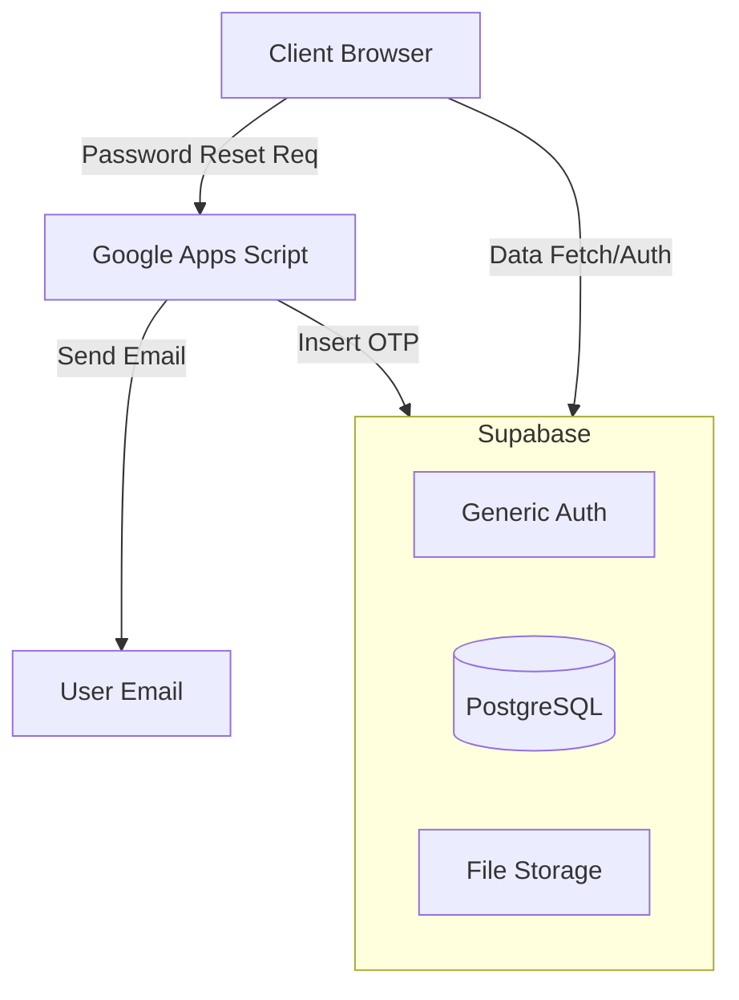

# SoDRé Web System Documentation

**SoDRé（ソドレ）** の公式ウェブサイトおよびコンテンツ管理システム（CMS）の技術仕様書・開発者マニュアルである。
本システムは、軽量なバニラJavaScript構成のフロントエンドと **Supabase** (BaaS) を組み合わせ、サーバーレスアーキテクチャで構築されている。また、一部の機能（メール送信など）に **Google Apps Script (GAS)** を採用している。

---

## 📖 目次

1.  [システムアーキテクチャ](#1-システムアーキテクチャ)
2.  [ディレクトリ構造](#2-ディレクトリ構造)
3.  [機能概要](#3-機能概要)
    *   [3.1 パブリックエリア](#31-パブリックエリア)
    *   [3.2 会員限定エリア](#32-会員限定エリア)
    *   [3.3 管理画面 (CMS)](#33-管理画面-cms)
4.  [環境構築とデプロイ](#4-環境構築とデプロイ)
    *   [4.1 Supabase セットアップ](#41-supabase-セットアップ)
    *   [4.2 Google Apps Script (GAS) セットアップ](#42-google-apps-script-gas-セットアップ)
    *   [4.3 ローカル開発環境](#43-ローカル開発環境)
5.  [テストと検証](#5-テストと検証)

---

## 1. システムアーキテクチャ

本システムは3つの主要コンポーネントで構成される。



*   **Frontend**: HTML5, CSS3, Vanilla JS。フレームワーク非依存で軽量かつ高速な動作を実現。
*   **Backend**: Supabase。認証（Auth）、データベース（PostgreSQL）、画像ストレージを担当。
*   **Utility**: Google Apps Script。パスワードリセット時のOTP（ワンタイムパスワード）生成とメール送信を行う。

---

## 2. ディレクトリ構造

主要な開発ファイルとディレクトリの構成は以下の通りである。

```text
c:\dev\sodre\
│
├── index.html              # トップページ (NEWS, DIARY, TOPICS表示)
├── admin.html              # 管理者用CMS (記事管理, ユーザー管理, 設定)
├── members-area.html       # 会員限定エリア (掲示板, グループ機能)
├── style.css               # グローバルスタイルシート (CSS Variables使用)
├── config.js               # SupabaseおよびGAS接続設定ファイル
│
├── js/ (ROOT直下配置のJSファイル群)
│   ├── admin.js            # 管理画面ロジック (認証, ステータス管理)
│   ├── login.js            # ログイン・パスワードリセット処理
│   ├── posts.js            # 記事取得・表示用ユーティリティ
│   ├── members-area.js     # 会員エリアロジック
│   └── calendar.js         # カレンダー描画・イベント管理
│
├── GAS/
│   └── gas_script_password_reset.gs  # パスワードリセット用GASコード
│
├── python/
│   └── test_gas.py         # GASエンドポイント疎通テスト用スクリプト
│
└── supabase/               # データベース定義SQL
    ├── schema.sql                   # 基本スキーマ
    ├── schema_user_management.sql   # ユーザー承認フロー用
    ├── schema_system_settings.sql   # システム設定・管理者キー管理
    └── schema_password_reset.sql    # OTPテーブル定義
```

---

## 3. 機能概要

### 3.1 パブリックエリア
一般ユーザーがアクセス可能なページ群。
*   **最新情報表示**: Supabaseから取得したNEWS, DIARY, TOPICSを動的に表示。
*   **カレンダー**: 練習日程やイベントを表示（`calendar.js`）。

### 3.2 会員限定エリア
ログイン済みユーザーのみがアクセス可能 (`members-area.html`)。
*   **グループ機能**: 所属グループごとの掲示板・情報共有。
*   **権限管理**: グループごとに `Can Post` (投稿可) / `Read Only` (閲覧のみ) の権限が設定される。

### 3.3 管理画面 (CMS)
管理者権限を持つユーザー専用 (`admin.html`)。
*   **コンテンツ管理**: NEWS, DIARY, TOPICSの作成・編集・削除。リッチテキストエディタ内蔵。
*   **ユーザー承認**: 新規登録申請されたユーザーの承認 (`pending` -> `created`) および却下。
*   **システム設定**: 管理者パスワードやメール設定の管理 (`system_settings` テーブル経由)。
*   **グループ管理**: グループの作成、メンバーの追加・権限変更。

---

## 4. 環境構築とデプロイ

### 4.1 Supabase セットアップ
1.  Supabaseプロジェクトを作成する。
2.  `supabase/` ディレクトリ内のSQLファイルを**以下の順序でQuery Editorにて実行**する。
    1.  `schema.sql` (基本テーブル)
    2.  `schema_user_management.sql` (ユーザー管理機能)
    3.  `schema_system_settings.sql` (システム設定機能)
    4.  `schema_password_reset.sql` (パスワードリセット機能)
    5.  その他必要な `schema_*.sql` ファイル

### 4.2 Google Apps Script (GAS) セットアップ
パスワードリセット機能（OTPメール送信）のために必要。
1.  Google Drive上で新規GASプロジェクトを作成する。
2.  `GAS/gas_script_password_reset.gs` の内容をコピー＆ペーストする。
3.  スクリプト内の `SUPABASE_URL` と `SUPABASE_KEY` (Service Role Key推奨) を設定する。
4.  **ウェブアプリとしてデプロイ**する。
    *   *Execute as*: **Me** (自分)
    *   *Who has access*: **Anyone** (全員)
5.  発行されたURLを控える。

### 4.3 ローカル開発環境
1.  `config.js` を作成・編集し、SupabaseとGASのエンドポイントを設定する。
    ```javascript
    window.SUPABASE_URL = "YOUR_SUPABASE_URL";
    window.SUPABASE_KEY = "YOUR_SUPABASE_ANON_KEY";
    
    // パスワードリセット用 (login.js等で使用)
    window.GAS_PASSWORD_RESET_URL = "YOUR_GAS_WEB_APP_URL";
    ```
2.  ローカルサーバー (Live Server等) を起動し、`index.html` にアクセスする。

---

## 5. テストと検証

### PythonによるGAS接続テスト
GASの正規表現やレスポンス確認のためにPythonスクリプトが用意されている。

```bash
cd python
# test_gas.py内の URL設定を確認後、実行
python test_gas.py
```
成功すると、SupabaseへのOTP登録とメール送信が実行されるため、テスト用メールアドレスをハードコードして使用することを推奨する。

---
© 2026 SoDRé & Junxiang Jin. All Rights Reserved.
